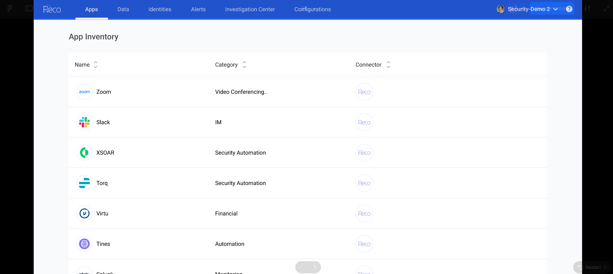
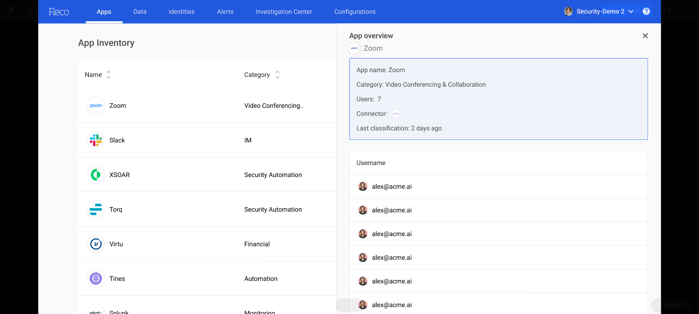
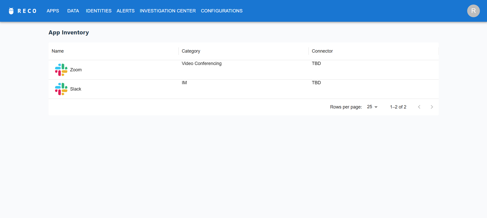
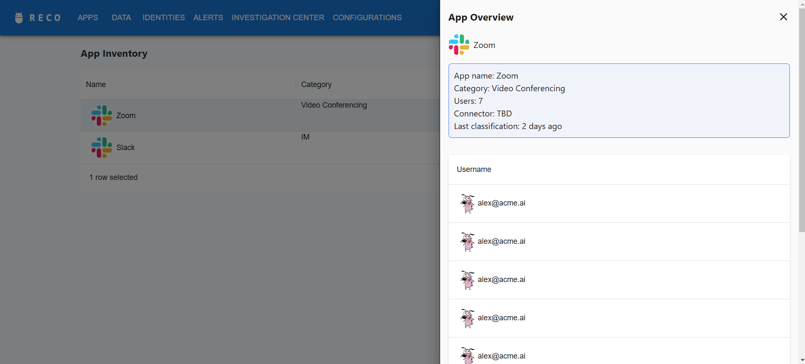

# Test Assignment - Application Inventory 
This is a React application, created from zero as a practical assignment during an interview. As part of the task, I was asked to turn on a camera and share my screen.  
**Time limit:** 3 hours
## Requirements
- Develop a screen (front-end application) using TypeScript React that looks and behaves like the App Inventory on the following mockups:  
  
  
- Create a table that will include the following columns:
  - Name 
  - Category 
  - Connector
- Make sure the table is set up to display 25 rows as the default view but allow users to switch to displaying 50 rows per page. 
- Click on the application row should open an application overview slide-in. 
  - Application overview slide-in should include:
    - Application Overview 
      - Application Name 
      - Category 
      - Connectors 
    - Table of connected users
## Result
- [x] Developed an application using **React 19** with **TypeScript**:  
  
  
- [x] The table includes sortable columns: Name, Category, Connector
- [x] The table is set up to display 25 rows as the default view but allow users to switch to displaying 50 rows per page
- [x] Click on the application row opens an application overview slide-in.
- [x] Application overview slide-in includes: application overview (application name, category, connector), category, table of connected users
### Additional libraries used for UI features:
  - SCSS Modules - `sass-embedded`
  - Material UI - `@mui/material`
  - Icons - `@mui/icons-material`
  - DataGrid - `@mui/x-data-grid`

### Notes
The application doesn't make any API requests, but uses mocked data instead (as specified during the interview).  
I focused on core functional features/specifications and left some UI and architecture adjustments for further improvements.
All of my changes were done iteratively, with branches and pull requests, with meaningful commit messages, to provide more visibility of my thinking.

### Further improvements
Here are some improvements/adjustments that I would do if I had more time for the task:
- Header: 
  - make links fully match the mockup
  - implement the page as an active route, to highlight the active link in header
- Datatable:
  - default icons for sorting in table
  - alignment of items in the datatable
- Code:
  - enable prettier rules and apply it automatically to all source code files
  - improve folder structure for a larger-scale application, i.e. create and fill the following folders
    - views - for views/pages
    - components - for components, such as sidebar, header, avatar, etc.
    - utils - for utility functions and helpers, such as string formatting and validation
    - api - for API modules and requests

---
## Install
`yarn install`
## Run
`yarn dev`  
http://localhost:5173/